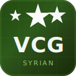

#  Syrian Private Programming VCG

<div align="center">


**لغة برمجة سورية حقيقية مفتوحة المصدر**  
مترجمها الكامل مكتوب بـ C11 · مخرجها HTML+JS · سهلة وقوية

[🌐 الموقع الرسمي](https://syrian-vcg.github.io/vcg-lang) · [📖 التوثيق](#-التوثيق) · [▶ جرّب الآن](#-مثال-سريع)

</div>

---

## 📋 جدول المحتويات

- [ما هي VCG؟](#-ما-هي-vcg)
- [المميزات](#-المميزات)
- [التثبيت](#-التثبيت)
- [مثال سريع](#-مثال-سريع)
- [التوثيق الكامل](#-التوثيق-الكامل)
- [هيكل المشروع](#-هيكل-المشروع)
- [الرخصة](#-الرخصة)

---

## 🌟 ما هي VCG؟

**Syrian Private Programming VCG** هي لغة برمجة نصية كاملة مصممة للمبرمجين العرب.

- 🔧 **المترجم** مكتوب بلغة **C11** الخالصة بدون مكتبات خارجية
- 🌐 **المخرج** ملف **HTML + JavaScript** يعمل في أي متصفح
- ⚡ **وضع المفسر** للتشغيل المباشر من سطر الأوامر
- 📦 **مكتبة قياسية** تحتوي 40+ دالة مدمجة

---

## ✨ المميزات

| الميزة | الوصف |
|--------|-------|
| 🔤 أنواع البيانات | `int`, `float`, `string`, `bool`, `nil`, `array`, `struct` |
| ⚙️ الدوال | تعريف، استدعاء، تكرار، closures، دوال عليا |
| 🔁 الحلقات | `while`, `for in`, `repeat`, `break`, `continue` |
| 🏗️ الهياكل | `struct`, literals, field access, methods |
| 🛡️ الأخطاء | `try`, `catch`, `throw`, `assert` |
| 🎯 Match | `match`/`when` لمطابقة الأنماط |
| 📐 العمليات | `+`, `-`, `*`, `/`, `%`, `**`, `..` (range), bitwise |
| 🔍 فحص الأنواع | `typeof()`, `sizeof()`, `isnil()`, `isnum()`, ... |

---

## ⬇ التثبيت

### من المصدر (Linux / macOS)

```bash
git clone https://github.com/syrian-vcg/vcg-lang.git
cd vcg-lang
make
sudo make install   # يثبّت في /usr/local/bin
```

### التحقق من التثبيت

```bash
vcgc --version
# vcgc 2.0.0
```

---

## ▶ مثال سريع

```vcg
# hello.vcg — أول برنامج VCG
let name = "سوريا"
show("مرحباً يا", name)

func factorial(n) {
    if n <= 1 { return 1 }
    return n * factorial(n - 1)
}

for i in 1..8 {
    show(i, "! =", factorial(i))
}
```

```bash
vcgc hello.vcg          # ينتج hello.html
vcgc -r hello.vcg       # تشغيل مباشر
vcgc -o out.html hello.vcg  # اسم مخرج مخصص
```

---

## 📖 التوثيق الكامل

### المتغيرات

```vcg
let x = 42
let name = "أحمد"
let pi = 3.14
let ok = true
let arr = [1, 2, 3]
let obj = { key: "value" }
const MAX = 100
```

### الشروط

```vcg
if x > 10 {
    show("أكبر من 10")
} else if x == 10 {
    show("يساوي 10")
} else {
    show("أصغر من 10")
}
```

### الحلقات

```vcg
# while
let i = 0
while i < 5 { i += 1 }

# for in
for x in [1, 2, 3] { show(x) }

# for in range
for n in 1..11 { show(n) }

# repeat
repeat 3 { show("تكرار!") }
```

### الدوال

```vcg
func greet(name, title) {
    return "مرحباً " + title + " " + name
}
show(greet("أحمد", "دكتور"))
```

### المصفوفات

```vcg
let arr = [10, 20, 30]
arr.push(40)
show(arr.pop())          # 40
show(arr.len())          # 3
show(arr.contains(20))   # true
show(arr.join(", "))     # "10, 20, 30"
show(arr.slice(0, 2))    # [10, 20]
arr.reverse()
```

### النصوص

```vcg
let s = "مرحباً بالعالم"
show(s.upper())
show(s.lower())
show(s.trim())
show(s.split(" "))
show(s.contains("مرحباً"))
show(s.replace("مرحباً", "أهلاً"))
show(s.len())
```

### الهياكل (Structs)

```vcg
struct Point { x, y }

func point_new(x, y) {
    return { x: x, y: y }
}
func point_dist(a, b) {
    let dx = b.x - a.x
    let dy = b.y - a.y
    return sqrt(dx*dx + dy*dy)
}

let p1 = point_new(0, 0)
let p2 = point_new(3, 4)
show("المسافة:", point_dist(p1, p2))  # 5
```

### معالجة الأخطاء

```vcg
func safe_div(a, b) {
    if b == 0 { throw "لا يمكن القسمة على صفر" }
    return a / b
}

try {
    show(safe_div(10, 0))
} catch err {
    show("خطأ:", err)
}
```

### مطابقة الأنماط

```vcg
func classify(n) {
    match n {
        when 0  -> return "صفر"
        when 1  -> return "واحد"
        when 2  -> return "اثنان"
    }
    return "أخرى"
}
```

### HTML مدمج

```vcg
html "<h2 style='color:#4dc95a'>عنوان من VCG</h2>"
html "<hr>"
show("نص عادي")
```

### المكتبة القياسية

| الدالة | الوصف |
|--------|-------|
| `abs(x)` | القيمة المطلقة |
| `floor(x)` / `ceil(x)` | تقريب |
| `sqrt(x)` | الجذر التربيعي |
| `pow(b, e)` | القوة |
| `sin(x)` / `cos(x)` / `tan(x)` | مثلثات |
| `min(a,b)` / `max(a,b)` | الأدنى / الأعلى |
| `clamp(v, lo, hi)` | تحديد نطاق |
| `rand(a, b)` | رقم عشوائي |
| `range(from, to, step)` | نطاق رقمي |
| `len(x)` | طول |
| `str(x)` | تحويل لنص |
| `int(x)` / `float(x)` | تحويل رقمي |
| `char(n)` / `ord(s)` | تحويل ASCII |
| `keys(obj)` / `values(obj)` | مفاتيح/قيم |
| `format(fmt, ...)` | تنسيق نص |
| `typeof(x)` / `sizeof(x)` | نوع/حجم |
| `isnil` / `isnum` / `isstr` / `isarr` | فحص النوع |

### خيارات المترجم

```bash
vcgc file.vcg              # ترجمة إلى HTML
vcgc -r file.vcg           # تشغيل مباشر (مفسر)
vcgc -o output.html file.vcg   # تحديد ملف الإخراج
vcgc -t dark file.vcg      # ثيم: dark|light|ocean
vcgc --tokens file.vcg     # عرض التوكنات
vcgc --ast file.vcg        # عرض شجرة AST
vcgc --version             # عرض الإصدار
```

---

## 📁 هيكل المشروع

```
vcg-lang/
├── compiler/
│   ├── include/
│   │   └── vcg.h          ← الهيدر الرئيسي (أنواع، رموز، AST)
│   └── src/
│       ├── lexer.c         ← المحلل اللغوي
│       ├── ast.c           ← شجرة الصياغة
│       ├── parser.c        ← المحلل النحوي
│       ├── value.c         ← قيم وقت التشغيل
│       ├── interpreter.c   ← المفسر
│       ├── stdlib.c        ← المكتبة القياسية
│       ├── codegen.c       ← مولّد HTML/JS
│       └── main.c          ← نقطة الدخول
├── examples/
│   ├── basic/
│   │   ├── hello.vcg
│   │   ├── variables.vcg
│   │   └── loops.vcg
│   └── advanced/
│       ├── fibonacci.vcg
│       ├── calculator.vcg
│       ├── structs.vcg
│       └── sorting.vcg
├── github/
│   ├── workflows/
│   │   └── ci.yml          ← GitHub Actions
│   └── pages/
│       └── index.html      ← GitHub Pages
├── tools/
│   ├── languages.yml       ← GitHub Linguist
│   └── VCG.tmLanguage.json ← Syntax Highlighting
├── tests/
│   ├── run_tests.sh
│   └── *.vcg
├── assets/
│   ├── icon.svg            ← الأيقونة
│   ├── icon.png
│   └── icon_256.png
├── output/                 ← ملفات HTML المُنتجة
├── Makefile
├── .gitattributes          ← GitHub Linguist detection
└── README.md
```

---

## 🧪 الاختبارات

```bash
make test
# أو
cd tests && bash run_tests.sh
```

---

## 🤝 المساهمة

1. Fork المشروع
2. أنشئ فرعاً جديداً: `git checkout -b feature/my-feature`
3. أضف تغييراتك وأضف اختبارات
4. ادفع: `git push origin feature/my-feature`
5. افتح Pull Request

---

## 📄 الرخصة

MIT License — للاستخدام الحر في المشاريع الشخصية والتجارية.

---

<div align="center">

صُنع بـ ❤️ للمجتمع المبرمج السوري والعربي

**Syrian Private Programming VCG v1.0**

</div>
